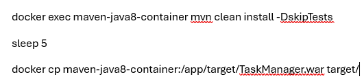

### Guía para el ejercicio AD-SE-WebJava-TrJrPr

**En este ejercicio se utilizan 2 características de GITHUB, se llaman Actions y Codespaces.**

Los Actions son flujos de trabajo que se activan al hacer un commit en el repositorio, la finalidad del Action en este ejercicio, es descargar el código en un área virtual propia de GITHUB.

De forma automática este Action compila el proyecto con Maven, crea una base de datos Mariadb, crea una tabla y posteriormente ejecuta los test del código con Maven.

**Este Action viene precargado y no se debe modificar.**

Si tienes como resultado algo parecido a esta pantalla, significa que algo salió mal entre la compilación, los test o tu código no apunta correctamente a la base de datos.

Para ver el detalle del error da clic en el resultado y te debe aparecer algo similar a esta imagen.

**Este ejercicio utiliza otra herramienta que se llama Codespaces. Un codespace es un ambiente de desarrollo que se hospeda en la nube.**

Este ejercicio cuenta con un docker-compose.yml que crea 3 contenedores de docker.

Teclea docker-compose up -d 

1.	Base de datos, para hacer la entrega debes utilizar esta base de datos, la base de datos se llama taskmanager, la tabla tiene la siguiente estructura:

Por lo que tu código debe apegarse a esta estructura, los datos para conectarse son:

2.	Server Maven, para hacer la entrega debes utilizar este contenedor ya que cuenta con las características técnicas que solicita el ejercicio.

<pre>     a.	Para interactuar con este contenedor tu código debe estar en src y a nivel raíz tu pom.xml</pre>

3.	Server Tomcat, para hacer la entrega debes utilizar este contenedor, este contenedor te permite visualizar tu proyecto dentro del codespace.

<pre>     a.	Para interactuar con este contenedor, es necesario contar con el war en la carpeta target.</pre>

**Cómo utilizar el codespace**

Para crear la base de datos se ejecutan estos comandos:

Esto crear la tabla que se debe usar en el ejercicio

Para compilar el código utiliza estas instrucciones:

Para desplegar el war utiliza esta instrucción:

docker cp target/TaskManager.war my-tomcat-container:/usr/local/tomcat/webapps/TaskManager.war

ahora da clic en puertos

Dentro de puertos visualiza 2 renglones, acerca el puntero a la Dirección enviada y da clic en la imagen de mundo

Esto abrirá el navegador.

Posiblemente veas esta pantalla 

Edita el link agregando al final /TaskManager y dá enter, debería ver algo similar a esta imagen:

**Recuerda borrar todos los Codespace abiertos.**

