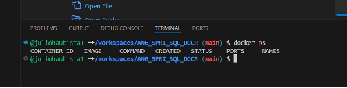

## **Para que el participante pueda acceder al ejercicio es necesario invitarlo a este repositorio**

### Indicaciones para invitar a un participante

Seleccionar settings.

 

Invitar a un colaborador.

Agregar.

Escribe el usuario a quien invitarás.

Mostrará este mensaje de invitación, quedará como pendiente y se quitará cuando el invitado la acepte.

### Evaluar a un participante

Para evaluar a un participante, selecciona Pull request, el número que veas a un lado es el número de participatnes que han enviado su solución.

Podrás identificar la entrega y al participante con los datos que aparecen con en la siguiente pantalla:

Selecciona el repositorio del participante para acceder a su action, como en la pantalla siguiente.

Esto te llevará al repositorio del participante, selecciona Actions.

Ahí podrás observar, si el action está en verde significa que todo se ejecutó correctamente.

En caso de que el action marque fallido, podrás consultar la falla dando click sobre el action.

Selecciona el action fallido para ver el detalle del log.

Podrás evaluar conforme al criterio definido para este ejercicio y notificarás al participante.

Si el action está en verde y requieres ver la solución funcionando, deberás utilizar un Codespace.

Asegúrate de estar en tu repositorio, ya que el repositorio del participante es muy parecido en cuanto a la estructura y rama.

Una vez que estés en tu repositorio como instructor, selecciona Pull request.

Selecciona el request del ejercicio y participante a evaluar.

Selecciona Code, luego la pestaña Codespaces y selecciona Create Codespace on ...

Tendrás una pantalla como esta en el browser.

Si requieres utilizar Visual Studio Code, regresa a la pantalla de tu repositorio, refresca y selecciona Code, selecciona Codespaces, selecciona los 3 puntos y selecciona Open in Visual Studio Code.

Espera unos minutos en lo que levanta el CodeSpace y tendrás una pantalla como esta:

Si no aparece la sección de la terminal presiona control-ñ.

Evalua la solución y notifica al participante.

**Recuerda borrar todos los Codespace abiertos.**

